PimaIndiansDiabetes2-Analysis
================
Arushi Sharma
4/26/2020

``` r
#importing libraries

library(dplyr)
library(ggplot2)
library(tidyr)
library(mlbench)
library(modelr)
library(purrr)
library(modelr)
```

\#Loading the dataset:

``` r
data(PimaIndiansDiabetes2)
PimaIndiansDiabetes2 <- PimaIndiansDiabetes2
dim(PimaIndiansDiabetes2)
```

    ## [1] 768   9

``` r
head(PimaIndiansDiabetes2)
```

    ##   pregnant glucose pressure triceps insulin mass pedigree age diabetes
    ## 1        6     148       72      35      NA 33.6    0.627  50      pos
    ## 2        1      85       66      29      NA 26.6    0.351  31      neg
    ## 3        8     183       64      NA      NA 23.3    0.672  32      pos
    ## 4        1      89       66      23      94 28.1    0.167  21      neg
    ## 5        0     137       40      35     168 43.1    2.288  33      pos
    ## 6        5     116       74      NA      NA 25.6    0.201  30      neg

### Corelation matrix to see the corelation between different variables with BMI

``` r
pairs(PimaIndiansDiabetes2)
```

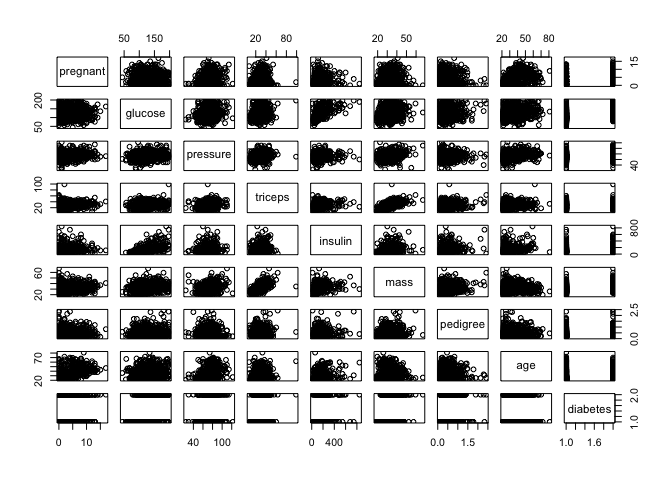<!-- -->

From the above plot we see, triceps have the best positive linear
corelation with mass among all other variables. And we see pressure is
also exhibiting a linear relationship. Glucose is also somehow
exhibiting linear relationship. Can’t predict diabetes. so, taking that
as well to check. So, selecting Triceps, Pressure, Glucose and diabetes
to check the relationship with mass using ggplots.

``` r
# Plotting triceps with mass to check the linear relation between them

ggplot(PimaIndiansDiabetes2, aes(x=triceps, y=mass)) + geom_point()
```

    ## Warning: Removed 229 rows containing missing values (geom_point).

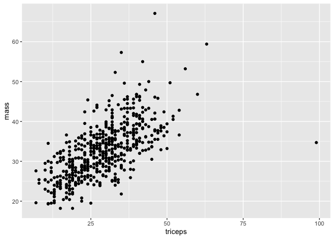<!-- -->

After plotting, we see that triceps relationship is linear with the
mass. Now, let’s check how pressure varies with mass.

``` r
#Plotting pressure with mass
ggplot(PimaIndiansDiabetes2, aes(x=pressure, y=mass)) + geom_point() 
```

    ## Warning: Removed 39 rows containing missing values (geom_point).

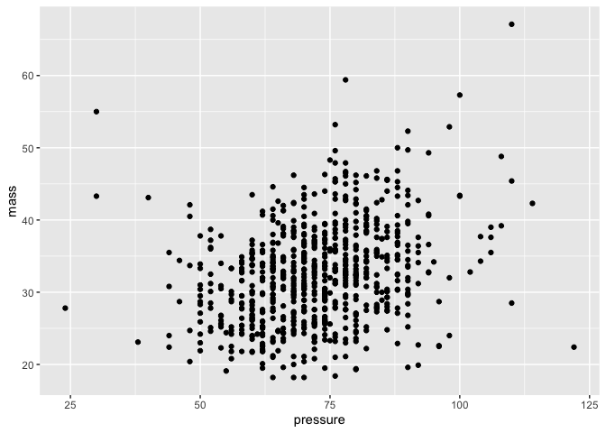<!-- -->

It looks like pressure is also varying linearly. To have a clear
picture, experimenting with taking log of individual vs both variables.

``` r
#Plotting by taking log of both pressure and mass
ggplot(PimaIndiansDiabetes2, aes(x=log(pressure), y=log(mass))) + geom_point()
```

    ## Warning: Removed 39 rows containing missing values (geom_point).

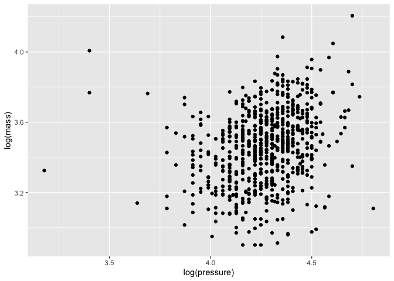<!-- -->

After taking log of both variables, we see that the relationship between
pressure and mass is quite linear. Now let’s plot diabetes and glucose
too to check.

``` r
#Plotting diabetes against mass
ggplot(PimaIndiansDiabetes2, aes(x=diabetes, y=mass)) + geom_boxplot()
```

    ## Warning: Removed 11 rows containing non-finite values (stat_boxplot).

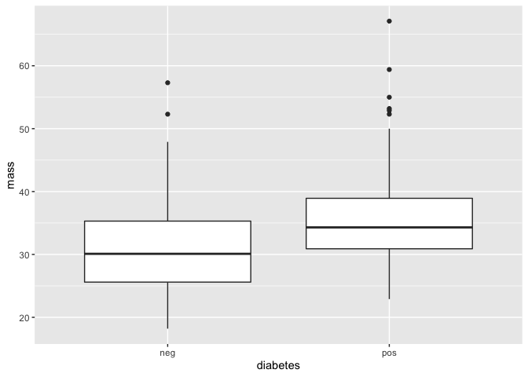<!-- -->

Diabetes have different medians and can be used as a good predictor
variable to estimate BMI. Now, testing the plot of glucose with mass.

``` r
#Plotting glucose against mass
ggplot(PimaIndiansDiabetes2, aes(x=glucose, y=mass)) + geom_point()
```

    ## Warning: Removed 16 rows containing missing values (geom_point).

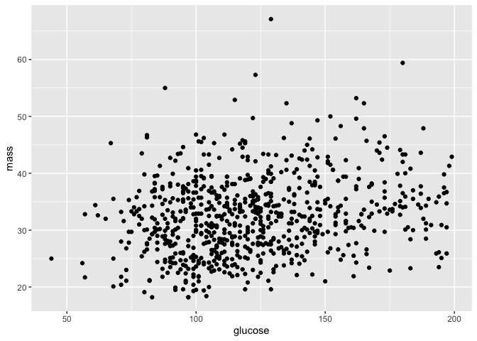<!-- -->

Glucose has a very weak linear relationship with mass. So, we can drop
it.

Among the variables tested, triceps has the strongest positive linear
relationship with mass.  
Diabetes also looks like a good predictor variable. Pressure also
exhibit a positive linear relation with mass when we take logs.  
So, selecting triceps and diabetes as the 2 predictor variables for body
mass index as they are having the most linear relationship with mass.

``` r
#Fitting linear model and printing the model summary

fit <- lm(mass ~ triceps + diabetes, data = PimaIndiansDiabetes2) 
summary(fit)
```

    ## 
    ## Call:
    ## lm(formula = mass ~ triceps + diabetes, data = PimaIndiansDiabetes2)
    ## 
    ## Residuals:
    ##      Min       1Q   Median       3Q      Max 
    ## -27.5251  -3.3805  -0.3945   2.9626  26.0237 
    ## 
    ## Coefficients:
    ##             Estimate Std. Error t value Pr(>|t|)    
    ## (Intercept) 20.51771    0.65554  31.299  < 2e-16 ***
    ## triceps      0.39903    0.02189  18.230  < 2e-16 ***
    ## diabetespos  2.20307    0.48639   4.529 7.29e-06 ***
    ## ---
    ## Signif. codes:  0 '***' 0.001 '**' 0.01 '*' 0.05 '.' 0.1 ' ' 1
    ## 
    ## Residual standard error: 5.145 on 536 degrees of freedom
    ##   (229 observations deleted due to missingness)
    ## Multiple R-squared:  0.4416, Adjusted R-squared:  0.4395 
    ## F-statistic: 211.9 on 2 and 536 DF,  p-value: < 2.2e-16

``` r
coef(fit)
```

    ## (Intercept)     triceps diabetespos 
    ##  20.5177112   0.3990335   2.2030727

``` r
sqrt(mean(resid(fit)^2))
```

    ## [1] 5.130506

``` r
mean(abs(resid(fit)))
```

    ## [1] 3.906733

Now, we want to check if the predictor variables that we selected were
proper or not. For that, we will plot the residuals of the fitted model
against the predictor variables we used to fit the model.

``` r
data <- PimaIndiansDiabetes2
fit <- lm(mass ~ (triceps + diabetes), data = data)
residual <- resid(fit)

data %>% add_residuals(fit) %>%
  ggplot() + geom_point(aes(x=triceps, y=resid))
```

    ## Warning: Removed 229 rows containing missing values (geom_point).

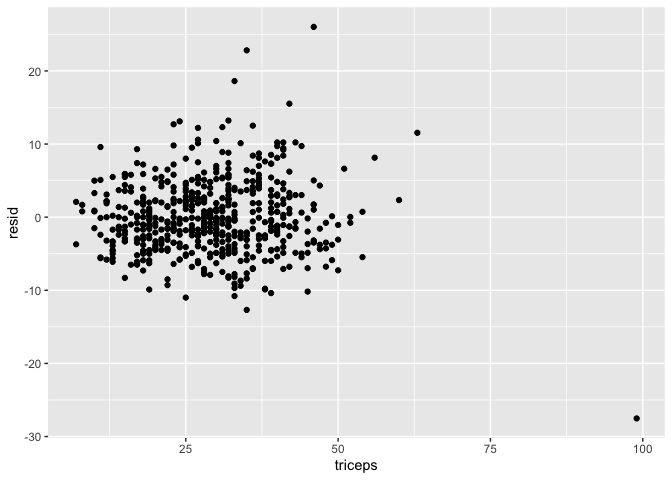<!-- -->

``` r
data %>% add_residuals(fit) %>%
  ggplot() + geom_boxplot(aes(x=diabetes, y=resid))
```

    ## Warning: Removed 229 rows containing non-finite values (stat_boxplot).

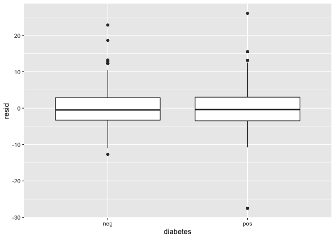<!-- -->

In the residual graph of triceps against residuals, we see that there is
no pattern which shows randomness. In residual graph against diabetes,
we see both the mean are at the same level and there is no variation.
So, we can say that triceps and diabetes are good predictor variables
and the model is appropriate.

Now, we will try to find out if there was any other variable which could
have made the model better.

``` r
#Testing pressure against residual:
data %>% add_residuals(fit) %>%
  ggplot() + geom_point(aes(x=pressure, y=resid))
```

    ## Warning: Removed 231 rows containing missing values (geom_point).

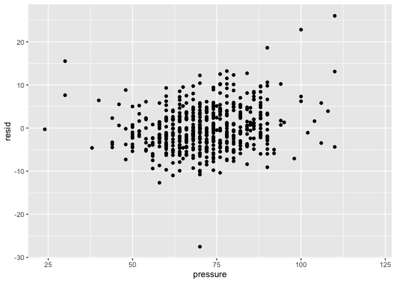<!-- -->

#### Testing for glucose

``` r
#Testing diabetes against residual:
data %>% add_residuals(fit) %>%
  ggplot() + geom_point(aes(x=glucose, y=resid))
```

    ## Warning: Removed 234 rows containing missing values (geom_point).

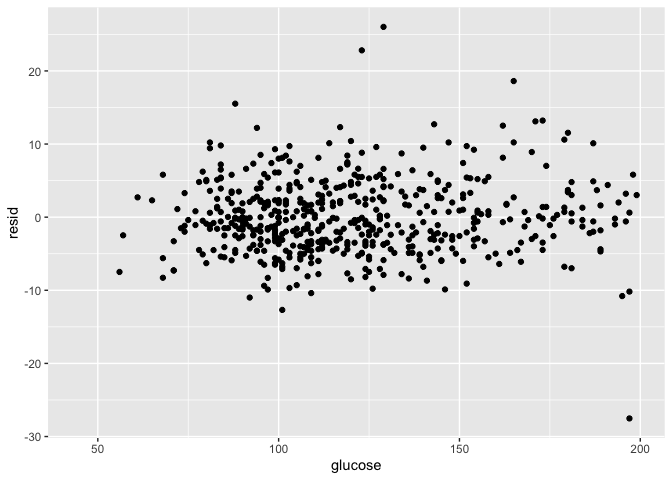<!-- -->

We can consider adding another predictor variable based on our previous
plots. We tested pressure earlier while selecting predictor variables,
which showed linear relationship with the mass and exhibited a random
scatter in the residual graph. So, we can consider taking pressure as a
predictor variable. Let’s add that to our model and see if it helps the
model.

``` r
fit1 <- lm(mass ~ (triceps + diabetes + pressure), data = data)
summary(fit)
```

    ## 
    ## Call:
    ## lm(formula = mass ~ (triceps + diabetes), data = data)
    ## 
    ## Residuals:
    ##      Min       1Q   Median       3Q      Max 
    ## -27.5251  -3.3805  -0.3945   2.9626  26.0237 
    ## 
    ## Coefficients:
    ##             Estimate Std. Error t value Pr(>|t|)    
    ## (Intercept) 20.51771    0.65554  31.299  < 2e-16 ***
    ## triceps      0.39903    0.02189  18.230  < 2e-16 ***
    ## diabetespos  2.20307    0.48639   4.529 7.29e-06 ***
    ## ---
    ## Signif. codes:  0 '***' 0.001 '**' 0.01 '*' 0.05 '.' 0.1 ' ' 1
    ## 
    ## Residual standard error: 5.145 on 536 degrees of freedom
    ##   (229 observations deleted due to missingness)
    ## Multiple R-squared:  0.4416, Adjusted R-squared:  0.4395 
    ## F-statistic: 211.9 on 2 and 536 DF,  p-value: < 2.2e-16

``` r
coef(fit)
```

    ## (Intercept)     triceps diabetespos 
    ##  20.5177112   0.3990335   2.2030727

``` r
sqrt(mean(resid(fit)^2))
```

    ## [1] 5.130506

``` r
mean(abs(resid(fit)))
```

    ## [1] 3.906733

After adding this variable to the model , we see that root mean square
has decreased by a tiny bit which is fine for the model. From all the
above conclusions and plotting, we can say it is good to add pressure as
a third predictor variable though it increases the model performance by
a
little.

#### Now, we will fit the model using 5-fold cross-validation and see how RMSE differs from the previous model.

``` r
#Creating function that performs cross validation

crossValidation <- function(myformula, data, k){
  set.seed(1)
  partitioned <- crossv_kfold(data, k)
  partitioned <- partitioned %>% 
    mutate(fit = map(train,~ lm(myformula, data = .))) %>%
    mutate(rmse_test = map2_dbl(fit, test, ~ rmse(.x, .y)))
  return (mean(partitioned$rmse_test))
}

#Cross validated RMSE of the model proposed above

crossValidation(mass ~ triceps + diabetes + pressure, PimaIndiansDiabetes2, 5)
```

    ## Warning: `as_data_frame()` is deprecated as of tibble 2.0.0.
    ## Please use `as_tibble()` instead.
    ## The signature and semantics have changed, see `?as_tibble`.
    ## This warning is displayed once every 8 hours.
    ## Call `lifecycle::last_warnings()` to see where this warning was generated.

    ## [1] 5.091698

We got the mean rmse of 5.09 while in previous model, the rmse of the
same model is 5.13. So, it shows that the model improves when done by
cross validation for the same set of predictor variables.

``` r
#Plotting the rm
set.seed(1)

predictors = c("triceps", "pressure", "diabetes", "glucose", "insulin")
fit_rmse <- data.frame(nvar = predictors, rmse =
                     c(crossValidation(mass ~ triceps, PimaIndiansDiabetes2, 5),
                       crossValidation(mass ~ triceps + pressure, PimaIndiansDiabetes2, 5),
                       crossValidation(mass ~ triceps + pressure + diabetes, PimaIndiansDiabetes2, 5),
                       crossValidation(mass ~ triceps + pressure + diabetes + glucose,
                                       PimaIndiansDiabetes2, 5),
                       crossValidation(mass ~ triceps + pressure + diabetes + glucose + insulin,
                                       PimaIndiansDiabetes2, 5)))


fit_rmse$nvar <- factor(fit_rmse$nvar, levels = c("triceps", "pressure", "diabetes",
                                                  "glucose", "insulin"))
fit_rmse
```

    ##       nvar     rmse
    ## 1  triceps 5.287360
    ## 2 pressure 5.153924
    ## 3 diabetes 5.091698
    ## 4  glucose 5.114037
    ## 5  insulin 5.126735

``` r
ggplot(fit_rmse) + aes(x=nvar, y = rmse, group=1) + geom_point() + geom_line() +
  labs(x="Predictors",
       y="RMSE",
       title="Plot showing rmse at each step of variable selection")
```

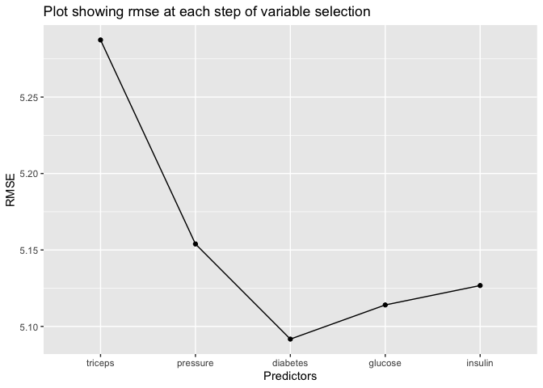<!-- -->

## Result of Analysis :

The 3rd model having triceps, pressure and diabetes is the most
predictive model, having rmse 5.091698. And we see when we add predictor
variable glucose and insulin to the model, the rmse increases.

So, the model lm(mass ~ triceps + diabetes + pressure) would be the best
model for predicting BMI.
