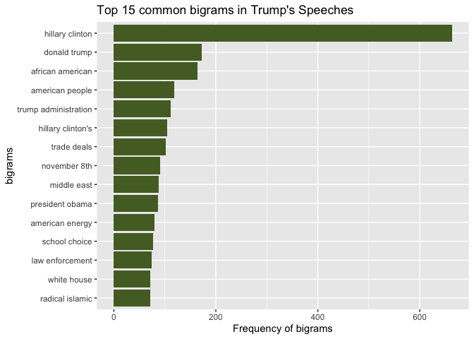
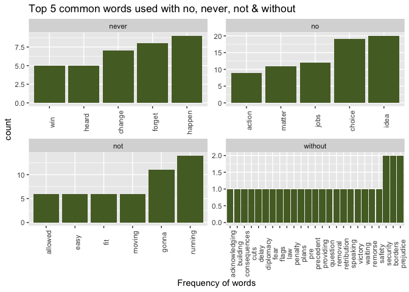
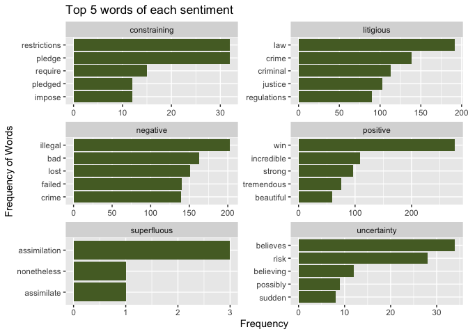

Sentiment Analysis
================
Arushi Sharma
4/26/2020

``` r
#Loading libraries

library(plyr)
library(dplyr)
library(ggplot2)
library(tidyr)
library(tokenizers)
library(tidytext)
library(ggraph)
library(igraph)
library(tidyverse)
library(stringr)
library(tidytext)
library(textdata)
library(SentimentAnalysis)
library(modelr)
library(gutenbergr)
library(rsample)
library(glmnet)
```

#### Importing the data:

``` r
#Reading Trump's speech file

trump_speech<- readLines("data/full_speech.txt")
#head(speech, n = 10)

#Preparing data for tidying
speech <- tibble(line=1:length(trump_speech), text=trump_speech)
```

#### Tokenizing and cleaning the data

``` r
# Tokenizing the data using bigrams as tokens

speech_bigram <- unnest_tokens(speech, bigram, text, token="ngrams", n=2)
head(speech_bigram, 5)
```

    ## # A tibble: 5 x 2
    ##    line bigram   
    ##   <int> <chr>    
    ## 1     1 trump wow
    ## 2     1 wow whoa 
    ## 3     1 whoa that
    ## 4     1 that is  
    ## 5     1 is some

``` r
#Filter the data by removing stopwords, applause and negation words  
tidy_speech <- speech_bigram %>% separate(bigram, c("word1", "word2"), sep = " ")
head(tidy_speech,5)
```

    ## # A tibble: 5 x 3
    ##    line word1 word2
    ##   <int> <chr> <chr>
    ## 1     1 trump wow  
    ## 2     1 wow   whoa 
    ## 3     1 whoa  that 
    ## 4     1 that  is   
    ## 5     1 is    some

``` r
tidy_speech1 <- tidy_speech %>%
  filter(!word1 %in% stop_words$word & !word2 %in% stop_words$word ) %>%
  filter(word1 != "applause" & word2 != "applause") %>%
  filter(!word1 %in% c("no", "never", "not", "without"))
head(tidy_speech1,5)
```

    ## # A tibble: 5 x 3
    ##    line word1     word2    
    ##   <int> <chr>     <chr>    
    ## 1     1 trump     wow      
    ## 2     1 wow       whoa     
    ## 3     1 people    thousands
    ## 4     1 trump     tower    
    ## 5     1 wonderful city

#### Creating bigram graph and plotting the most common bigrams of Trump

``` r
trump_graph <- tidy_speech1 %>%
unite(bigrams, word1,word2,sep=" ") %>%
count(bigrams,sort=TRUE) %>%
mutate(bigrams=reorder(bigrams,n)) %>%
head(15) 


ggplot(trump_graph, aes(x=bigrams,y=n)) +
geom_col(fill = "darkolivegreen") + coord_flip() +
labs(y="Frequency of bigrams",title="Top 15 common bigrams in Trump's Speeches")
```

<!-- -->

The top 3 most common bigrams in Trump’s speech are Hillary Clinton,
Donald Trump and african american in the same
order.

#### Now, lets find out the most commonly negated words in Donald Trump’s speeches

We will be filtering the bigrams, keeping only bigrams where the first
word is any of “not”, “no”, “never”, or “without”,and removing those
where the second word is a stop word or “applause”. Then we will
visualize the most common(top ~5) words preceded (separately) by each of
“never”, “no”, “not”, and “without”.

``` r
#Filtering bigrams

tidy_speech %>%
  filter(word1 %in% c("no","never","not","without")) %>%
  filter(!word2 %in% stop_words$word & !word2 %in% "applause") %>%
  count(word1,word2,sort = TRUE) %>%
  mutate(word2=reorder(word2,n)) %>%
  group_by(word1) %>%
  top_n(5) %>%
  ggplot(aes(x=reorder(word2,n),y=n)) +
  geom_col(fill="darkolivegreen") +
  theme(axis.text.x=element_text(angle=90)) +
  labs(y="count") +
  facet_wrap(~word1, ncol=2,scales="free") +
  labs(x="Frequency of words", title="Top 5 common words used with no, never, not & without ")
```

    ## Selecting by n

<!-- -->

The most common negated bigrams are no idea, never happen, not running
and without prejudice.

#### Now, we will do a sentiment analysis of Donald Trump’s speeches.

In order to make sure sentiments are assigned to appropriate contexts,
we will first tokenize the speeches into bigrams, and filter out all
bigrams where the first word is any of the words “not”, “no”, “never”,
or “without”. Now we will consider only the second word of each bigram
and filter out all bigrams where the second word is a stopword or
“applause”. We then would visualize the most common words (top ~5) in
Trump’s speeches that are associated with each of the 6 sentiments in
the “loughran” lexicon.

``` r
filtered_speech <- tidy_speech %>%
  filter(!word1 %in% c("no","never","not","without")) %>%
  filter(!word2 %in% stop_words$word & !word2 %in% "applause")

loughran <- get_sentiments("loughran")
head(loughran,5)
```

    ## # A tibble: 5 x 2
    ##   word         sentiment
    ##   <chr>        <chr>    
    ## 1 abandon      negative 
    ## 2 abandoned    negative 
    ## 3 abandoning   negative 
    ## 4 abandonment  negative 
    ## 5 abandonments negative

``` r
speech_sentiments <- filtered_speech %>%
  inner_join(loughran, by=c("word2"="word")) %>%
  count(word2, sentiment) %>%
  mutate(word2=reorder(word2,n)) %>%
  group_by(sentiment) %>%
  top_n(5)

ggplot(data = speech_sentiments, aes(x=word2,y=n)) +
geom_col(fill = "darkolivegreen") +
coord_flip() +
labs(y="Frequency") +
facet_wrap(~sentiment, ncol=2,scales="free") +
labs(x="Frequency of Words", title="Top 5 words of each sentiment")
```

<!-- -->

#### From the plot, we see the major proportion of top 5 words in negative sentiment is higher than the rest 5 sentiments.
